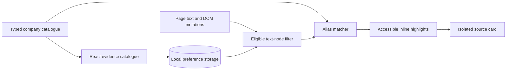

<div align="center">

# Climate Criminals

### See the company. Read the evidence.

**🏅 Prize-Winning Project at HackSwift**

[](tests)


[](LICENSE)

[Get started](#get-started) · [Architecture](docs/architecture.md) · [Data & sources](docs/data.md) · [Privacy](docs/privacy.md)

</div>

Climate Criminals adds an environmental context layer to the web. It recognizes company names in page text and connects them to attributed reporting and research through accessible, source-linked cards. A searchable React catalogue puts the evidence, publisher, and publication date in one place.

## What it does

- **Context in the page.** Company mentions become keyboard-accessible highlights. Open a card, inspect the source, and return to the page with Escape.
- **A typed evidence catalogue.** Each record includes aliases, sector, an attributed summary, publisher, source link, and date or an explicit undated label.
- **Deterministic entity matching.** Longest aliases take precedence; Unicode-aware boundaries avoid matching names inside larger words.
- **Designed for changing pages.** A debounced `MutationObserver` processes added and changed text, with a 250-highlight cap per page.
- **Careful DOM integration.** Links, forms, code, editable text, and existing highlights are excluded. Evidence cards use Shadow DOM to isolate their styles.
- **On-device by design.** Matching uses the bundled catalogue. No page text, browsing history, or queries are uploaded. A local toggle pauses highlighting and restores page text.

## Get started

Requires **Node.js 22.12+** and a recent Chrome or compatible Chromium browser.

```bash
git clone https://github.com/asharma391/Climate-Criminals.git
cd Climate-Criminals
npm ci
npm run build
```

Open `chrome://extensions`, enable **Developer mode**, choose **Load unpacked**, and select **`dist/`**. Open or refresh a normal web page containing a supported company name, then click a highlight to read its source card.

Chrome’s internal pages and extension-store pages do not allow content scripts. Existing tabs may need a refresh after installation. Chrome’s site-access controls can restrict where the extension runs.

```bash
npm run dev   # Standalone popup preview; does not install the extension
```

Search the catalogue, filter by sector, or pause page highlighting from the popup. In preview mode, the toggle changes only the preview state.

## Architecture



```text
src/
├── content/      # DOM traversal, lifecycle, and isolated source cards
├── core/         # Pure, Unicode-aware alias matcher
├── data/         # Typed company records and source provenance
└── popup/        # React search, sector filters, and highlighting controls
public/          # Manifest and original extension icons
scripts/         # Vite + esbuild packaging
tests/           # Matcher and DOM regression tests
docs/            # Architecture, data policy, and privacy
```

The popup is a React application; the content script is a compact, self-contained bundle with no React runtime injected into visited pages. Pure matching logic is tested independently from DOM operations. [Read the architecture →](docs/architecture.md)

## Development

| Command          | Purpose                                       |
| ---------------- | --------------------------------------------- |
| `npm run dev`    | Preview the React popup                       |
| `npm run build`  | Type-check and package the unpacked extension |
| `npm test`       | Run matcher and DOM regression tests          |
| `npm run check`  | Type-check, test, and production-build        |
| `npm run format` | Format source and documentation               |

A ready-to-enable [GitHub Actions workflow](docs/ci.yml) checks formatting, types, tests, and the production build, then uploads the unpacked extension. To enable it, copy the template to `.github/workflows/ci.yml` using a GitHub credential with workflow permission. All checks have also been run locally.

## Evidence, not a black-box score

The initial catalogue contains **three curated records**: Apple, Aramco, and Siemens Energy. Sources are historical and are labeled accordingly. This is name-based matching, not identity verification: an ambiguous word such as “Apple” can refer to something other than a company. Read the linked source and its date before interpreting a match.

The project does not infer a live sustainability score, run an AI classifier, or claim comprehensive company coverage. Its useful boundary is transparent source discovery. [Catalogue policy and sources →](docs/data.md)

## Project roots

Originally built for **HackSwift**, where it received an **honourable mention**. This edition replaces the original bundled JavaScript prototype with typed source modules, a React evidence index, safer DOM behavior, and regression tests. Original authorship, history, and icons are retained.

To add a record, follow [the data guide](docs/data.md) and [contribution instructions](CONTRIBUTING.md). Licensed under [GPL-3.0](LICENSE).
